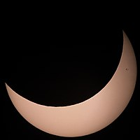

<br>Submitted: `r Sys.Date()` <br>Author: `r params$name` <br> Email: `r params$email` <br> Phone: `r params$phone` <br> 

```{r lockfile, include=FALSE}
renv::use(
  askpass      = "askpass@1.2.1",
  assertthat   = "assertthat@0.2.1",
  base64enc    = "base64enc@0.1-3",
  bslib        = "bslib@0.9.0",
  cachem       = "cachem@1.1.0",
  censusxy     = "chris-prener/censusxy@bdcb5141fe6a9dfc15c6b1fee6dde24376ef2bda",
  cli          = "cli@3.6.4",
  codetools    = "codetools@0.2-20",
  colorspace   = "colorspace@2.1-1",
  commonmark   = "commonmark@1.9.2",
  cpp11        = "cpp11@0.5.1",
  crayon       = "crayon@1.5.3",
  curl         = "curl@6.2.1",
  digest       = "digest@0.6.37",
  doParallel   = "doParallel@1.0.17",
  evaluate     = "evaluate@1.0.3",
  farver       = "farver@2.1.2",
  fastmap      = "fastmap@1.2.0",
  fontawesome  = "fontawesome@0.5.3",
  foreach      = "foreach@1.5.2",
  fs           = "fs@1.6.5",
  generics     = "generics@0.1.3",
  glue         = "glue@1.8.0",
  highr        = "highr@0.11",
  htmltools    = "htmltools@0.5.8.1",
  httpuv       = "httpuv@1.6.15",
  httr         = "httr@1.4.7",
  iterators    = "iterators@1.0.14",
  jpeg         = "jpeg@0.1-10",
  jquerylib    = "jquerylib@0.1.4",
  jsonlite     = "jsonlite@1.9.0",
  knitr        = "knitr@1.49",
  labeling     = "labeling@0.4.3",
  later        = "later@1.4.1",
  lifecycle    = "lifecycle@1.0.4",
  lubridate    = "lubridate@1.9.4",
  magrittr     = "magrittr@2.0.3",
  memoise      = "memoise@2.0.1",
  mime         = "mime@0.12",
  munsell      = "munsell@0.5.1",
  openssl      = "openssl@2.3.2",
  promises     = "promises@1.3.2",
  qrcode       = "qrcode@0.3.0",
  R6           = "R6@2.6.1",
  rappdirs     = "rappdirs@0.3.3",
  RColorBrewer = "RColorBrewer@1.1-3",
  Rcpp         = "Rcpp@1.0.14",
  renv         = "renv@1.1.1",
  rlang        = "rlang@1.1.5",
  rmarkdown    = "rmarkdown@2.29",
  sass         = "sass@0.4.9",
  scales       = "scales@1.3.0",
  shiny        = "shiny@1.10.0",
  sourcetools  = "sourcetools@0.1.7-1",
  swephR       = "swephR@0.3.1",
  sys          = "sys@3.4.3",
  timechange   = "timechange@0.3.0",
  tinytex      = "tinytex@0.55",
  viridisLite  = "viridisLite@0.4.2",
  withr        = "withr@3.0.2",
  xfun         = "xfun@0.50",
  xtable       = "xtable@1.8-4",
  yaml         = "yaml@2.3.10"
)
```

```{r setup, include=FALSE, echo = T}
#knitr::opts_chunk$set(echo = TRUE)

#renv::embed()
library(renv)
library(jpeg)
library(qrcode)
library(censusxy)
library(swephR)
library(lubridate)
library(scales)

output_lonlat   <- "empty"
output_gregtime <- "empty"

```

## ***Abstract***

#### **One hobbyist's attempt (using R) to never again miss a solar eclipse:**

Since 2017 there have been 3 major solar eclipse events visible in North Carolina:

<pre>-   a total solar eclipse: &nbsp;&nbsp;&nbsp;&nbsp;August 21, 2017 (73% obscuration), 
-   an annular solar eclipse: &nbsp;October 14, 2023 (23% obscuration), and 
-   a total solar eclipse: &nbsp;&nbsp;&nbsp;&nbsp;April 8, 2024 (14% obscuration) </pre>

I missed the 2023 event. Kinda. As an annular eclipse[^3] the moon is at it's farthest point from Earth and thus cannot obustruct the full disk of the sun. So you 

[^3]: An annular solar eclipse happens when the Moon passes between the Sun and Earth, but when it is at or near its farthest point from Earth. Because the Moon is farther away from Earth, it appears smaller than the Sun and does not completely cover the Sun. As a result, the Moon appears as a dark disk on top of a larger, bright disk, creating what looks like a ring around the Moon. (Source: [NASA](https://science.nasa.gov/eclipses/types/#h-annular-solar-eclipse))

**HOWEVER, I remembered a day in the fall of 2023 when the sky began to darken for no apparent reason** and realized a few months later as I was making this shiny app that I had experienced a solar eclipse without even realizing it.

That's the moment I knew I needed a different eclipse planning tool - a way to never miss a solar (or lunar) eclipse again, no matter where I'm at on Earth.  

A [shiny webapp](https://tim-bender.shinyapps.io/shiny_all_eclipses/)[^1] that calculates all visible solar and lunar eclipses for up to the next 75 years specific to your current lon/lat coordinate location. 


### **Background - oops we missed an eclipse**

-   After driving my school-age kids about 9 hours to see totality during the [North American total solar eclipse](https://science.nasa.gov/eclipses/future-eclipses/eclipse-2024/) of April 2024, I realized that we had missed the annular solar eclipse just [7 months earlier](https://en.wikipedia.org/wiki/Solar_eclipse_of_October_14,_2023) that was less-well publicized. Not wanting to miss any opportunity to see an eclipse again I began considering my problem.

### **Problem - it's hard finding good information on upcoming celestial events**

-   Reliable eclipse predictions are freely available online though they are usually generalized to a state-level geography. In April 2024 there were parts of Dallas, TX that could view totality (image below, left) for more than 4 minutes, and other parts that were outside the path of totality and saw only a partial eclipse (image below, right).

{width="254"}{width="250"}

#### **Solution - Build a shiny app**

-   A shiny app that will use your current location (or a specific address input by user) to identify every solar and lunar eclipse viewable from that location for the next (n) years.\
-   Current functioning webapp: Future Solar and Lunar Eclipses Visible from Your Current Location ([Shiny webapp](https://tim-bender.shinyapps.io/shiny_all_eclipses/))
-   Relying primarily on the following packages/libraries:
-   *swephR* ([via CRAN](https://cran.r-project.org/package=swephR)): High Precision Swiss Ephemeris package. Used to determine when, where and how solar and lunar eclipses will occur (among other novel celestial events).
-   *leaflet* ([via CRAN](https://cran.r-project.org/package=leaflet)): Create Interactive Web Maps with the JavaScript 'Leaflet' Library
-   *shiny* ([via CRAN](https://cran.r-project.org/package=shiny)): Web Application Framework for R.
-   *censusxy* ([via github](https://github.com/chris-prener/censusxy)): Designed to provide easy access to the U.S. Census Bureau Geocoding Tools
-   *qrcode* ([via CRAN](https://cran.r-project.org/package=qrcode)): Create static QR codes in R. Implemented so that users could share between mobile devices.

<!-- -   App I/Os: -->

<!--     -   number of years (n) to look into the future (I) -->

<!--     -   A date_time value to search from (I) -->

<!--     -   A lon/lat coordinate pair derived from the user's i.p. address (with permission) (I) -->

<!--     -   A USPS mailing address to geocode a lon/lat coordinate pair for a specific viewing location (I) -->

<!--     -   A date_time value for the every eclipse visible from the (I) viewing location for the next (n) years (O) -->

<!--     -   Eclipse type (solar/lunar) (O) -->

<!--     -   Eclipse sub type (total/partial...) (O) -->

<!--     -   Obscuration (% of sun blocked by moon as seen from viewing location - solar eclipse only) (O) -->

<!--     -   A lon/lat coordinate pair for the location of the maximal view of the eclipse on Earth (O)  -->

<!--     -   A dynamic leaflet map showing the lon/lat coordinate pairs (I & O) -->

```{r Eclipse Calcs, echo=T, eval = T, message=FALSE, warning=FALSE, results="show"}
# SOME CODE to capture solar eclipse information 
library(swephR)
library(lubridate)
library(scales)

## Example Input Variables
input_lonlat   <- c("lon" = -78.938, "lat" = 36.001)  # Duke Univ
input_gregtime <- ymd_hms("2025-08-08 01:00:00",      # Start of useR! 2025
                          tz = "America/New_York") |> 
  with_tz("UTC") 

## Example Solar Eclipse Calculation
# convert gregorian time to julian time (ephemeral time i.e. "ET")
var_jultime <- swe_utc_to_jd(year  = year(input_gregtime), 
                             month = month(input_gregtime), 
                             day   = mday(input_gregtime), 
                             houri = hour(input_gregtime), 
                             min   = minute(input_gregtime), 
                             sec   = second(input_gregtime), 
                             gregflag = SE$GREG_CAL)$dret[2]

# calculate the next solar eclipse visible anywhere on earth
nextGlobEcl_Jd <- swe_sol_eclipse_when_glob(jd_start  = var_jultime, 
                                            ephe_flag = SE$FLG_MOSEPH, 
                                            ifltype   = 0, 
                                            backward  = F)$tret[c(1)]

# convert to gregorian time
nextEcl.temp <- swe_jdet_to_utc(jd_et    = nextGlobEcl_Jd, 
                                gregflag = SE$GREG_CAL)

output_gregtime <- paste(nextEcl.temp$year_out,"-",
                         nextEcl.temp$month_out,"-",
                         nextEcl.temp$day_out," ",
                         nextEcl.temp$hour_out,":",
                         nextEcl.temp$min_out,":",
                         nextEcl.temp$sec_out,
                         sep = "") |>
  ymd_hms()

# Will the eclipse be visible from our location? 
output_visible <- swe_sol_eclipse_how(jd_ut     = nextGlobEcl_Jd, 
                                      ephe_flag = SE$FLG_MOSEPH, 
                                      geopos    = c(input_lonlat["lon"], 
                                                    input_lonlat["lat"],0))
output_obscuration <- output_visible$attr[3]

output_visible <- ifelse(output_visible$`return` == 0 | # "no eclipse visible" 
                           output_visible$attr[3] == 0, # % of sun blocked by moon == 0.0
                         yes = F, no = T) |> 
  ifelse(yes = "Visible from input location",
         no  = "Not visible from input location")

# Where is the best viewing location geometrically? 
output_xy <- swe_sol_eclipse_where(jd_ut     = nextGlobEcl_Jd, 
                                   ephe_flag = SE$FLG_MOSEPH)$pathpos[c(1,2)]
names(output_xy) <- c("lon", "lat")


## Example Returned Values
print(list("Eclipse_DateTime"      = output_gregtime, 
           "Visible_Locally"       = output_visible,
           "Obscuration_Locally"   = percent(output_obscuration,
                                             accuracy = 0.1),
           "Maximal_View.Globally" = output_xy))

```

<!-- ```{r Static Map, echo=T, message=FALSE, warning=FALSE, results="hide", eval = FALSE} -->

<!-- # SOME CODE for a static map verification of input lon/lat -->

<!-- library(ggmap) -->

<!-- library(dplyr) -->

<!-- library(sf) -->

<!-- ## Must run once per session -->

<!-- # register_stadiamaps(key = "your_key_here", write = FALSE) -->

<!-- bbox <- make_bbox(lon = c(input_lonlat["lon"], output_lonlat["lon"]),  -->

<!--                   lat = c(input_lonlat["lat"], output_lonlat["lat"]),  -->

<!--                   f   = var_map.f) -->

<!-- map.stamen <- get_stadiamap(bbox = bbox,  -->

<!--                             zoom = 3,  -->

<!--                             maptype = "stamen_toner_lite", -->

<!--                             crop = T,  -->

<!--                             color = "color", -->

<!--                             force = T, -->

<!--                             size = 1) -->

<!-- ggmap(map.stamen) + -->

<!--   geom_label(aes(x = input_lonlat["lon"],  -->

<!--                  y = input_lonlat["lat"]),  -->

<!--              label = "Duke University",  -->

<!--              color = "blue", alpha = 0.1) + -->

<!--   geom_label(aes(x = output_lonlat["lon"],  -->

<!--                  y = output_lonlat["lat"]),  -->

<!--              label = "Eclipse Maximal",  -->

<!--              color = "brown", alpha = 0.1) -->

<!-- ``` -->

<!--  -->

```{r Geocode USPS Address, echo=F, include = F, eval = F, message=FALSE, warning=FALSE}
## SOME CODE to query and geocode USPS mailing addresses for lon/lat coordinates
# install("devtools")
# devtools::install_github("chris-prener/censusxy")
library(censusxy)
addr_input     <- "401 Chapel Drive, Durham, NC 27708"
addrcxy_output <- cxy_oneline(address = addr_input)
addr_output    <- addrcxy_output[c("coordinates.x", 
                                   "coordinates.y")]
names(addr_output) <- c("lon", "lat")

print(addr_output)

```

```{r Interactive Dashboard, eval=FALSE, message=FALSE, warning=FALSE, include=F, results="hide"}
# SOME CODE to build a shiny dashboard to deploy an interactive webapp
library(shiny)

ui <- fluidPage(
  # address search input
  # eclipse calculations
  
)
server <- function(input, output, session) {
  # geocode address
}
shinyApp(ui, server)
```

```{r Dynamic map with leaflet, echo=TRUE, eval = F, results = "show", include = F, message=FALSE, warning=FALSE}
# SOME CODE to replace the static map with a dynamic map
library(leaflet)

leaflet(padding = 0, 
        height = "300px", 
        width = "auto") |> 
  addTiles() |> 
  addMarkers(label = c("Duke University", "Eclipse Maximal"), 
             lng   = c(input_lonlat["lon"], output_lonlat["lon"]),
             lat   = c(input_lonlat["lat"], output_lonlat["lat"])) |>
  expandLimits(lng = c(input_lonlat["lon"], output_lonlat["lon"])*1.000,
               lat = c(input_lonlat["lat"], output_lonlat["lat"])*1.000) |> 
  addScaleBar(position = "topright") 
```

```{r Get lon-lat automatically via ip address, eval=FALSE, message=FALSE, warning=FALSE, include=F, results="hide"}
# SOME CODE to capture input lon-lat automatically via i.p. address with consent

```

## ***Broad Topic Covered***

#### **You thought time was confusing on earth**

-   Astronomers still use the Julian Calendar to track the cosmos

#### **Communication & Ease-of-Use**

-   Longitude / Latitude\
-   User Experience

#### **Knowing what to do VS Knowing how to do**

## Learning Goals

-   main goal

-   You don't have to know ~~everything~~ ~~anything~~ as much as you think you do.

-   Evolving your skills and knowledge throughout a project lifecycle: pros and cons.

## Timezone Preference(s)

-   I live about 15 minutes from Duke University so any presentation I would prefer in-person if possible. Otherwise America/New_York \<--\> America/Los_Angeles

## Duration

-   Open to any of the following:
    -   Talk (15-20 minutes) - (in-person)
    -   Lightning Talk (5 minutes) - (in-person)
    -   Poster / visual presentation

## Language

-   English

## Intended Audience

-   Eclipse seekers
-   Beginners and hobbyists looking for:
    -   project idea inspiration,
    -   a better understanding on how to approach the project life cycle, and
    -   managing project creep

## Pedagogical Method of Teaching

-   For this I would approach in a lecture-style while allowing for interaction. I'm a seasoned public speaker in front of local elected and appointed officials and in engaging public meetings.

## Maximum Number of Attendees

-   I would imagine the number of attendees interested would be relatively low due to the field intersections - astronomy x geospatial x public_communication. But if you are asking how many people I would be comfortable presenting in front of, there is no lower or upper bounds.

## Motivation to Teach this Tutorial at useR!

-   I enjoy making things in R (mostly as a hobby right now), I made a thing that's pretty neat and would like to share my experience in the hope that there are others who could benefit from either technical or general information shared.
-   I became VERY MOTIVATED when I saw that useR! 2025 was at Duke University in Durham as I live only a few miles away. It just seemed like the opportunity was right.

## Supplemental Material Links

#### Tutorial materials

-   Future Solar and Lunar Eclipses Visible from Your Current Location ([Shiny webapp](https://tim-bender.shinyapps.io/shiny_all_eclipses/))

#### Web Page (if applicable)

## Prerequisites / requirements

-   None

## License, Material sharing, recording consent

-   Eclipse Predictions by Fred Espenak (diagrams in-app only), [www.EclipseWise.com](www.EclipseWise.com) - The use of diagrams and maps is permitted provided they are NOT altered (except for re-sizing) and the embedded credit line is NOT removed or covered.

## ***Biography***

#### Tim Bender, (title)

-   Bachelor of Urban Planning from the University of Cincinnati.\

-   \~15 years local government experience as an urban planner and transit planner. Tim was part of a team that helped deploy Google Transit for his transit agency in Kentucky in 2008, being among the first 50-ish agencies worldwide to go live.\

-   Journey with R began with a desire to log transit vehicle real-time location data from an api for analysis but I had no programming experience or knowledge of how to approach the problem. I wouldn't successfully solve this problem for about 5 years of self-guided learning.

-   [LinkedIn](https://www.linkedin.com/in/tim-bender-238870171/)

-   [github](https://github.com/benda18)
