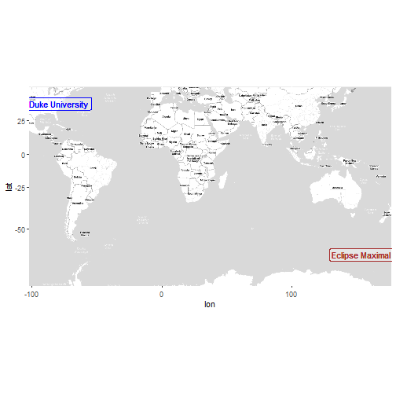

## Abstract

One hobbyist's attempt to use R to never miss a solar or lunar eclipse again.

## Outline

-   Problem / Background
    -   Like many people during the winter of 2023-2024 I was preparing travel plans for the upcoming [North American total solar eclipse](https://science.nasa.gov/eclipses/future-eclipses/eclipse-2024/) in April of 2024. In order to get the full solar eclipse experience you really need to view what's know as **totality**.[^1]
    -   {insert image of totality vs. not totality}
    -   While a partial eclipse was viewable across almost the entirety of North America, only a narrow path between Mexico and the United States from the southwest to the northeast allowed viewing of **totality.**
    -   {map of path of eclipse}
    -   Many online tools were available to help you determine the very best place to travel to see totality based on crowd size, anticipated traffic jams, cloud cover forecasts for the day and time of the eclipse and other factors. However, Almost all of these, while useful, felt cluttered, overly-complicated and didn't really provide the information I was looking for anyways.
-   What Features Did I Want in an Eclipse Tool?
    -   **Increased geographic accuracy**: The main problem I had was quickly and easily verifying how long totality would be visible from specific longitude / latitude coordinate locations. Eclipse Planning tools approached solving this problems in 1 of 2 ways:
        -   *Easy to use but not accurate*: Commonly a list of major cities within totality would be [listed with general information as seen here](https://eclipse2024.org/somcow24.html). The problem being however, that depending on the size of the city there could be places partially outside of totality, with only a few seconds view of totality, and/or 4 or more minutes of view of totality (close to the max). An extreme example is Dallas, TX where parts of the city were both outside of the view of totality and almost at the maximum view.
        -   *Accurate but not easy to use*: The other approach was providing an [interactive map like this one from the National Solar Observatory](https://nso.edu/for-public/eclipse-map-2024/) where you could click on your viewing location and be provided with information about whether it was within the path of totality, how long you could see it, and even what time totality would begin and end. However, I could not find a tool with an address search box that would allow for simple queries of locations that way. <!-- -   Broad Solution --> <!--     -   some text -->
-   Approach
    -   Using the [swephR](https://cran.r-project.org/package=swephR) High Precision Swiss Ephemeris package, one may:
        -   find the next solar (or lunar) eclipse for a given geographic position,

        -   find the next solar (or lunar) eclipse globally,

        -   find the attributes of a solar (or lunar) eclipse for a given geographic position and time, and/or

        -   plot the path of a total or annular solar eclipse on a map.

[^1]: the moment or duration of total obscuration of the sun or moon during an eclipse.


``` r
# SOME CODE to capture solar eclipse information 
library(swephR)
library(lubridate)

## Example Input Variables
input_lonlat   <- c("lon" = -78.938, "lat" = 36.001)  # Duke Univ
input_gregtime <- ymd_hms("2025-08-08 01:00:00",      # Start of useR! 2025
                          tz = "America/New_York") |> 
  with_tz("UTC") 

## Example Solar Eclipse Calculation
# convert gregorian time to julian time (ephemeral time i.e. "ET")
var_jultime <- swe_utc_to_jd(year  = year(input_gregtime), 
                             month = month(input_gregtime), 
                             day   = mday(input_gregtime), 
                             houri = hour(input_gregtime), 
                             min   = minute(input_gregtime), 
                             sec   = second(input_gregtime), 
                             gregflag = SE$GREG_CAL)$dret[2]

# calculate the next solar eclipse visible anywhere on earth
nextGlobEcl_Jd <- swe_sol_eclipse_when_glob(jd_start  = var_jultime, 
                                            ephe_flag = SE$FLG_MOSEPH, 
                                            ifltype   = 0, 
                                            backward  = F)$tret[c(1)]

# convert to gregorian time
nextEcl.temp <- swe_jdet_to_utc(jd_et    = nextGlobEcl_Jd, 
                                gregflag = SE$GREG_CAL)

output_gregtime <- paste(nextEcl.temp$year_out,"-",
                         nextEcl.temp$month_out,"-",
                         nextEcl.temp$day_out," ",
                         nextEcl.temp$hour_out,":",
                         nextEcl.temp$min_out,":",
                         nextEcl.temp$sec_out,
                         sep = "") |>
  ymd_hms()

# Will the eclipse be visible from our location? 
output_visible <- swe_sol_eclipse_how(jd_ut     = nextGlobEcl_Jd, 
                                      ephe_flag = SE$FLG_MOSEPH, 
                                      geopos    = c(input_lonlat["lon"], 
                                                    input_lonlat["lat"],0))

output_visible <- ifelse(output_visible$`return` == 0 | # "no eclipse visible" 
                           output_visible$attr[3] == 0, # % of sun blocked by moon == 0.0
                         yes = F, no = T) |> 
  ifelse(yes = "Visible from input location",
         no  = "Not visible from input location")

# Where is the best viewing location geometrically? 
output_lonlat <- swe_sol_eclipse_where(jd_ut     = nextGlobEcl_Jd, 
                                         ephe_flag = SE$FLG_MOSEPH)$pathpos[c(1,2)]
names(output_lonlat) <- c("lon", "lat")


## Example Returned Values
# print(output_gregtime) # "[date and time of the solar eclipse (UTC)]"
# print(output_visible)  # "[is the eclipse visible from input_location?]"
# print(output_lonlat) # "[lon/lat attributes - maximal eclipse]"

print(list("Eclipse_DateTime" = output_gregtime, 
           "Visible_Locally"  = output_visible,
           "Maximal_View.xy"  = output_lonlat))
```

```
## $Eclipse_DateTime
## [1] "2025-09-21 19:40:51 UTC"
## 
## $Visible_Locally
## [1] "Not visible from input location"
## 
## $Maximal_View.xy
##       lon       lat 
## 153.38805 -61.03134
```


``` r
# SOME CODE for a static map verification of input lon/lat
library(ggmap)
library(dplyr)
library(sf)

## Must run once per session
# register_stadiamaps(key = "your_key_here", write = FALSE)

bbox <- make_bbox(lon = c(input_lonlat["lon"], output_lonlat["lon"]), 
                  lat = c(input_lonlat["lat"], output_lonlat["lat"]), 
                  f   = var_map.f)

map.stamen <- get_stadiamap(bbox = bbox, 
                            zoom = 3, 
                            maptype = "stamen_toner_lite",
                            crop = T, 
                            color = "color",
                            force = T,
                            size = 1)
ggmap(map.stamen) +
  geom_label(aes(x = input_lonlat["lon"], 
                 y = input_lonlat["lat"]), 
             label = "Duke University", 
             color = "blue", alpha = 0.1) +
  geom_label(aes(x = output_lonlat["lon"], 
                 y = output_lonlat["lat"]), 
             label = "Eclipse Maximal", 
             color = "brown", alpha = 0.1)
```




``` r
## SOME CODE to query and geocode USPS mailing addresses for lon/lat coordinates
# install("devtools")
# devtools::install_github("chris-prener/censusxy")
library(censusxy)
addr_input     <- "401 Chapel Drive, Durham, NC 27708"
addrcxy_output <- cxy_oneline(address = addr_input)
addr_output    <- addrcxy_output[c("coordinates.x", 
                                   "coordinates.y")]
names(addr_output) <- c("lon", "lat")

print(addr_output)
```

```
##         lon      lat
## 1 -78.93751 36.00054
```


``` r
# SOME CODE to build a shiny dashboard to deploy an interactive webapp
library(shiny)

ui <- fluidPage(
  # address search input
  # eclipse calculations
  
  
)
server <- function(input, output, session) {
  # geocode address
}
shinyApp(ui, server)
```


``` r
# SOME CODE to replace the static map with a dynamic map
library(leaflet)

leaflet(padding = 0, 
        height = "300px", 
        width = "auto") |> 
  addTiles() |> 
  addMarkers(label = c("Duke University", "Eclipse Maximal"), 
             lng   = c(input_lonlat["lon"], output_lonlat["lon"]),
             lat   = c(input_lonlat["lat"], output_lonlat["lat"])) |>
  expandLimits(lng = c(input_lonlat["lon"], output_lonlat["lon"])*1.000,
               lat = c(input_lonlat["lat"], output_lonlat["lat"])*1.000) |> 
  addScaleBar(position = "topright") 
```

```{=html}
<div id="htmlwidget-e40daa23b0701cb2738b" style="width:auto;height:300px;" class="leaflet html-widget"></div>
<script type="application/json" data-for="htmlwidget-e40daa23b0701cb2738b">{"x":{"options":{"crs":{"crsClass":"L.CRS.EPSG3857","code":null,"proj4def":null,"projectedBounds":null,"options":{}}},"calls":[{"method":"addTiles","args":["https://{s}.tile.openstreetmap.org/{z}/{x}/{y}.png",null,null,{"minZoom":0,"maxZoom":18,"tileSize":256,"subdomains":"abc","errorTileUrl":"","tms":false,"noWrap":false,"zoomOffset":0,"zoomReverse":false,"opacity":1,"zIndex":1,"detectRetina":false,"attribution":"&copy; <a href=\"https://openstreetmap.org/copyright/\">OpenStreetMap<\/a>,  <a href=\"https://opendatacommons.org/licenses/odbl/\">ODbL<\/a>"}]},{"method":"addMarkers","args":[[36.001,-61.03133879351671],[-78.938,153.3880478036793],null,null,null,{"interactive":true,"draggable":false,"keyboard":true,"title":"","alt":"","zIndexOffset":0,"opacity":1,"riseOnHover":false,"riseOffset":250},null,null,null,null,["Duke University","Eclipse Maximal"],{"interactive":false,"permanent":false,"direction":"auto","opacity":1,"offset":[0,0],"textsize":"10px","textOnly":false,"className":"","sticky":true},null]},{"method":"addScaleBar","args":[{"maxWidth":100,"metric":true,"imperial":true,"updateWhenIdle":true,"position":"topright"}]}],"limits":{"lat":[-61.03133879351671,36.001],"lng":[-78.938,153.3880478036793]}},"evals":[],"jsHooks":[]}</script>
```


``` r
# SOME CODE to capture input lon-lat automatically via i.p. address with consent
```

## Broad Topic Covered

## Learning Goals

-   main goal

-   You don't have to know ~~everything~~ ~~anything~~ as much as you think you do.

-   Evolving your skills and knowledge throughout a project lifecycle: pros and cons.

## Timezone Preference(s)

## Duration

## Language

## Intended Audience

-   Solar and lunar eclipse seekers
-   Beginners and hobbyists looking for:
    -   project idea inspiration,
    -   a better understanding on how to approach the project life cycle, and
    -   managing project creep

## Pedagogical Method of Teaching

## Maximum Number of Attendees

## Motivation to Teach this Tutorial at useR!

## Supplemental Material Links

#### Tutorial materials

-   Future Solar and Lunar Eclipses Visible from Your Current Location ([Shiny webapp](https://tim-bender.shinyapps.io/shiny_all_eclipses/))

#### Web Page (if applicable)

## Prerequisites / requirements

## License, Material sharing, recording consent

## Biography

#### Tim Bender, (title)

-   [hold for bio]
-   [LinkedIn](https://www.linkedin.com/in/tim-bender-238870171/)
-   [github](https://github.com/benda18)
