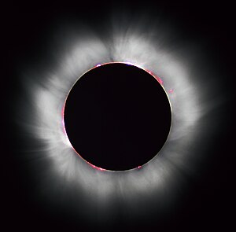
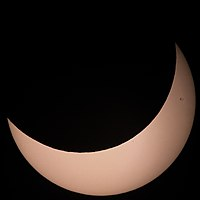

## ***Abstract***

One hobbyist's attempt to use R to never miss a solar or lunar eclipse again.

#### **Background - oops we missed an eclipse**

-   After driving my school-age kids about 9 hours to see totality during the [North American total solar eclipse](https://science.nasa.gov/eclipses/future-eclipses/eclipse-2024/) of April 2024, I realized that we had missed the annular solar eclipse just [7 months earlier](https://en.wikipedia.org/wiki/Solar_eclipse_of_October_14,_2023) that was less-well publicized. Not wanting to miss any opportunity to see an eclipse again I began considering my problem.

#### **Problem - it's hard finding good information on upcoming celestial events**

-   Reliable eclipse predictions are freely available online though they are usually generalized to a state-level geography. In April 2024 there were parts of Dallas, TX that could view totality (image below, left) for more than 4 minutes, and other parts that were outside the path of totality and saw only a partial eclipse (image below, right).

{width="254"}{width="250"}

#### **Solution - Build a shiny app**
-   A shiny app that will use your current location (or a specific address input by user) to identify every solar and lunar eclipse viewable from that location for the next (n) years.  
-   Current functioning webapp: Future Solar and Lunar Eclipses Visible from Your Current Location ([Shiny webapp](https://tim-bender.shinyapps.io/shiny_all_eclipses/)) 
-   Relying primarily on the following packages/libraries:
-   *swephR* ([via CRAN](https://cran.r-project.org/package=swephR)): High Precision Swiss Ephemeris package.  Used to determine when, where and how solar and lunar eclipses will occur (among other novel celestial events).
-   *leaflet* ([via CRAN](https://cran.r-project.org/package=leaflet)): Create Interactive Web Maps with the JavaScript 'Leaflet' Library
-   *shiny* ([via CRAN](https://cran.r-project.org/package=shiny)): Web Application Framework for R. 
-   *censusxy* ([via github](https://github.com/chris-prener/censusxy)): Designed to provide easy access to the U.S. Census Bureau Geocoding Tools
-   *qrcode* ([via CRAN](https://cran.r-project.org/package=qrcode)): Create static QR codes in R. Implemented so that users could share between mobile devices. 

<!-- -   App I/Os: -->
<!--     -   number of years (n) to look into the future (I) -->
<!--     -   A date_time value to search from (I) -->
<!--     -   A lon/lat coordinate pair derived from the user's i.p. address (with permission) (I) -->
<!--     -   A USPS mailing address to geocode a lon/lat coordinate pair for a specific viewing location (I) -->
<!--     -   A date_time value for the every eclipse visible from the (I) viewing location for the next (n) years (O) -->
<!--     -   Eclipse type (solar/lunar) (O) -->
<!--     -   Eclipse sub type (total/partial...) (O) -->
<!--     -   Obscuration (% of sun blocked by moon as seen from viewing location - solar eclipse only) (O) -->
<!--     -   A lon/lat coordinate pair for the location of the maximal view of the eclipse on Earth (O)  -->
<!--     -   A dynamic leaflet map showing the lon/lat coordinate pairs (I & O) -->


``` r
# SOME CODE to capture solar eclipse information 
library(swephR)
library(lubridate)
library(scales)

## Example Input Variables
input_lonlat   <- c("lon" = -78.938, "lat" = 36.001)  # Duke Univ
input_gregtime <- ymd_hms("2025-08-08 01:00:00",      # Start of useR! 2025
                          tz = "America/New_York") |> 
  with_tz("UTC") 

## Example Solar Eclipse Calculation
# convert gregorian time to julian time (ephemeral time i.e. "ET")
var_jultime <- swe_utc_to_jd(year  = year(input_gregtime), 
                             month = month(input_gregtime), 
                             day   = mday(input_gregtime), 
                             houri = hour(input_gregtime), 
                             min   = minute(input_gregtime), 
                             sec   = second(input_gregtime), 
                             gregflag = SE$GREG_CAL)$dret[2]

# calculate the next solar eclipse visible anywhere on earth
nextGlobEcl_Jd <- swe_sol_eclipse_when_glob(jd_start  = var_jultime, 
                                            ephe_flag = SE$FLG_MOSEPH, 
                                            ifltype   = 0, 
                                            backward  = F)$tret[c(1)]

# convert to gregorian time
nextEcl.temp <- swe_jdet_to_utc(jd_et    = nextGlobEcl_Jd, 
                                gregflag = SE$GREG_CAL)

output_gregtime <- paste(nextEcl.temp$year_out,"-",
                         nextEcl.temp$month_out,"-",
                         nextEcl.temp$day_out," ",
                         nextEcl.temp$hour_out,":",
                         nextEcl.temp$min_out,":",
                         nextEcl.temp$sec_out,
                         sep = "") |>
  ymd_hms()

# Will the eclipse be visible from our location? 
output_visible <- swe_sol_eclipse_how(jd_ut     = nextGlobEcl_Jd, 
                                      ephe_flag = SE$FLG_MOSEPH, 
                                      geopos    = c(input_lonlat["lon"], 
                                                    input_lonlat["lat"],0))
output_obscuration <- output_visible$attr[3]

output_visible <- ifelse(output_visible$`return` == 0 | # "no eclipse visible" 
                           output_visible$attr[3] == 0, # % of sun blocked by moon == 0.0
                         yes = F, no = T) |> 
  ifelse(yes = "Visible from input location",
         no  = "Not visible from input location")

# Where is the best viewing location geometrically? 
output_xy <- swe_sol_eclipse_where(jd_ut     = nextGlobEcl_Jd, 
                                   ephe_flag = SE$FLG_MOSEPH)$pathpos[c(1,2)]
names(output_xy) <- c("lon", "lat")


## Example Returned Values
print(list("Eclipse_DateTime"      = output_gregtime, 
           "Visible_Locally"       = output_visible,
           "Obscuration_Locally"   = percent(output_obscuration,
                                             accuracy = 0.1),
           "Maximal_View.Globally" = output_xy))
```

```
## $Eclipse_DateTime
## [1] "2025-09-21 19:40:51 UTC"
## 
## $Visible_Locally
## [1] "Not visible from input location"
## 
## $Obscuration_Locally
## [1] "0.0%"
## 
## $Maximal_View.Globally
##       lon       lat 
## 153.38805 -61.03134
```


<!-- ```{r Static Map, echo=T, message=FALSE, warning=FALSE, results="hide", eval = FALSE} -->
<!-- # SOME CODE for a static map verification of input lon/lat -->
<!-- library(ggmap) -->
<!-- library(dplyr) -->
<!-- library(sf) -->

<!-- ## Must run once per session -->
<!-- # register_stadiamaps(key = "your_key_here", write = FALSE) -->

<!-- bbox <- make_bbox(lon = c(input_lonlat["lon"], output_lonlat["lon"]),  -->
<!--                   lat = c(input_lonlat["lat"], output_lonlat["lat"]),  -->
<!--                   f   = var_map.f) -->

<!-- map.stamen <- get_stadiamap(bbox = bbox,  -->
<!--                             zoom = 3,  -->
<!--                             maptype = "stamen_toner_lite", -->
<!--                             crop = T,  -->
<!--                             color = "color", -->
<!--                             force = T, -->
<!--                             size = 1) -->
<!-- ggmap(map.stamen) + -->
<!--   geom_label(aes(x = input_lonlat["lon"],  -->
<!--                  y = input_lonlat["lat"]),  -->
<!--              label = "Duke University",  -->
<!--              color = "blue", alpha = 0.1) + -->
<!--   geom_label(aes(x = output_lonlat["lon"],  -->
<!--                  y = output_lonlat["lat"]),  -->
<!--              label = "Eclipse Maximal",  -->
<!--              color = "brown", alpha = 0.1) -->
<!-- ``` -->

<!--  -->


## ***Broad Topic Covered***


#### **You thought time was confusing on earth

-   Astronomers still use the Julian Calendar to track the cosmos**

#### **Communication & Ease-of-Use**

-   Longitude / Latitude  
-   User Experience

#### **Knowing what to do VS Knowing how to do**

## Learning Goals

-   main goal

-   You don't have to know ~~everything~~ ~~anything~~ as much as you think you do.

-   Evolving your skills and knowledge throughout a project lifecycle: pros and cons.

## Timezone Preference(s)
-   America/New_York +/-.  

## Duration
-   Open to any of the following: 
    -   20 minute session (in-person)
    -   5 minute session (in-person)
    -   poster board 
    
## Language
-   English

## Intended Audience
-   Eclipse seekers
-   Beginners and hobbyists looking for:
    -   project idea inspiration,
    -   a better understanding on how to approach the project life cycle, and
    -   managing project creep

## Pedagogical Method of Teaching
-   For this I would approach in a lecture-style while allowing for interaction.  I'm a seasoned public speaker in front of local elected and appointed officials and in engaging public meetings.  

## Maximum Number of Attendees
-   I would imagine the number of attendees interested would be relatively low due to the field intersections - astronomy x geospatial x public_communication.  But if you are asking how many people I would be comfortable presenting in front of, there is no lower or upper bounds.  

## Motivation to Teach this Tutorial at useR!
-   I enjoy making things in R (mostly as a hobby right now), I made a thing that's pretty neat and would like to share my experience in the hope that there are others who could benefit from either technical or general information shared. 
-   I became VERY MOTIVATED when I saw that useR! 2025 was at Duke University in Durham as I live only a few miles away.  It just seemed like the opportunity was right.  

## Supplemental Material Links

#### Tutorial materials

-   Future Solar and Lunar Eclipses Visible from Your Current Location ([Shiny webapp](https://tim-bender.shinyapps.io/shiny_all_eclipses/))

#### Web Page (if applicable)

## Prerequisites / requirements
-   None

## License, Material sharing, recording consent
-   

## ***Biography***

#### Tim Bender, (title)

-   [hold for bio]
-   [LinkedIn](https://www.linkedin.com/in/tim-bender-238870171/)
-   [github](https://github.com/benda18)
